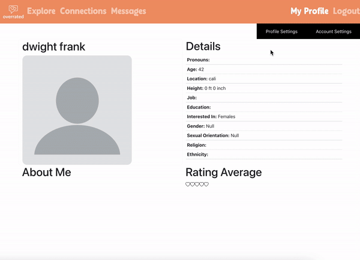
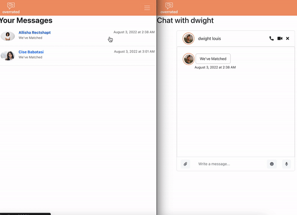
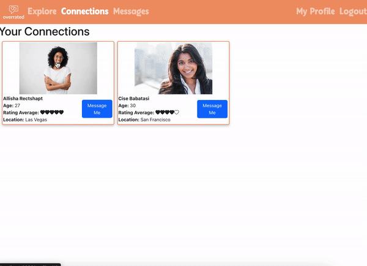

<h1 align="center">💞&nbsp; Welcome to Overrated &nbsp;💞</h1>

<p align="center">Overrated is a dating web application that allows a user to match with their potential soul mate based on gender preference and leave a rating for another user after matching </p>
<hr>

## Table of Contents 
- [Technologies Used](#technologies-used)
- [Intended Market](#intended-market)
- [Functionality](#functionality)
- [Design](#design)
    - [API design](docs/apis.md)
    - [Data tables](docs/data-model.md)
    - [GHI](docs/ghi.md)
    - [Integrations](docs/integrations.md)
- [Installation/Setup](#installationsetup)
- [Application Overview](#application-overview)
- [Authors](#authors)

<hr>

## Technologies Used 
          
<br>
<hr>

## Intended market 
* Adults over the age of 18 residing in the USA
* Adults who want to make new connections
* People who are critical of others
<br>
<hr>

## Functionality 
* Profile creation and updating 
* User authentication
* Ability to upload an image to the user's profile 
* Viewing potential matches that fit the user's gender preference
* The ability to mark interest in a profile with a like and dislike button
* Two profiles form a connection after both have marked an interest in each other 
* A rating feature that is available after a connection is made 
* Live chat feature 
<br>
<hr>

## Design
- [API design](docs/apis.md)
- [Data tables](docs/data-model.md)
- [GHI](docs/ghi.md)
- [Integrations](docs/integrations.md)
<br>
<hr>

## Installation/Setup
1. Install [Docker](https://docs.docker.com/get-docker/)
2. Git fork and clone this repo and navigate into the ```/overrated``` directory
    ```sh
    cd overrated
    ```
3. Create an AWS S3 account and put the environment variables into an .env file in the top level directory
    ```sh
    AWS_SERVER_PUBLIC_KEY = ""
    AWS_SERVER_SECRET_KEY = ""
    ```
4. Create the docker volumes
    ```sh
    docker volume create overrated
    docker volume create pg-admin
    ```
5. Docker compose build then up
    ```sh
    docker compose build 
    docker compose up
    ```
<br>

Access the application on [http://localhost:3000](http://localhost:3000) <br>
FastAPI Swagger UI access on [http://localhost:8000/docs](http://localhost:8000/docs)
<br>
<hr>

## Application Overview
<div align="center">
<h3><b>Home page</b></h3>


<br>

<h3><b>Sign up, login and logout pages</b></h3>


<br>

<h3><b>Edit profile & account pages</b></h3>


<br>

<h3><b>Chat with a connection</b></h3>


<br>

<h3><b>Rate a profile</b></h3>

</div>
<br>
<hr>

## Authors
👤 [**Yesenia**](https://www.yeseniar.dev) <br>
👤 [**Andrew**](https://github.com/theandrewliu) <br>
👤 [**Corey**](https://gitlab.com/corey.daniel.edwards)<br>
👤 [**Jeremy**](https://gitlab.com/j.max.mao) <br>
